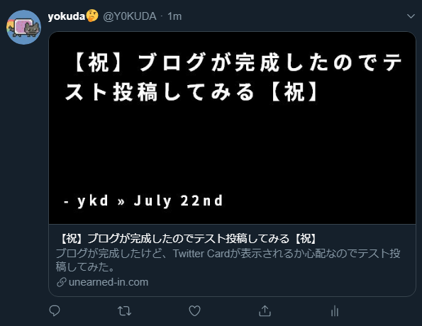

Gatsby製サイトのリンクをTwitterに貼ったときこういう表示になります。  
  
プラグインのリンクは↓です  
https://github.com/Y0KUDA/gatsby-remark-social-cards-jp/

# Twitter Cardの仕組み
htmlに以下のタグを埋め込んでおくと、リンクを貼ったときにTwitter Cardが表示されます。  
このような仕様をOGPと言います。  

```html
<meta name="twitter:card" content="summary_large_imageもしくはsummary"/>
<meta property="og:url" content="ページのURL"/>
<meta property="og:title" content="記事のタイトル"/>
<meta property="og:description" content="記事のディスクリプション"/>
<meta property="og:image" content="画像のURL"/>
```


# Twitter Cardを表示する方法
上記コードの1-4行目は簡単に実装できますが、[gatsby-remark-social-cards](https://www.gatsbyjs.org/packages/gatsby-remark-social-cards/)というプラグインを利用すると画像を自動で生成することができます。使い方はリンクを参照してください。  
残念なことに、現時点では日本語を表示するには自分で以下の対応を行う必要があります。

* 日本語ビットマップフォントの用意
* 画像から文字がはみ出ないように改行させる  

上記対応を行ったものが
[gatsby-remark-social-cards-jp](https://github.com/Y0KUDA/gatsby-remark-social-cards-jp/)
です。  
よければ、本家が日本語に対応するまでのつなぎとして使ってください。（対応する予定があるかわかりませんが。）

# フォントの作り方
フォントが気に入らない場合、[Bitmap Font Generator](http://www.angelcode.com/products/bmfont/)を使って既存のフォントからビットマップフォントを生成することができます。
細かい使い方は簡単なので割愛しますが、出力オプションで以下の設定をしないと正しく動作しないので注意してください。  
* テクスチャを`png`にする
* Bit depthを32にする  

完成したら`gatsby-remark-social-cards`のディレクトリにある`fonts`ディレクトリにフォントファイルを`[フォント名]_[色:black/white]_[書体:norma/italic/bold]_[size].fnt`の名前で配置します。テクスチャファイルも同じディレクトリにすべてコピーします。  
これでお好みのフォントでTwitter Cardを生成することができます！