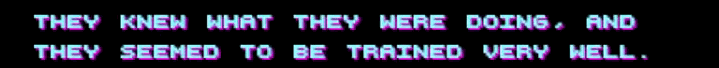
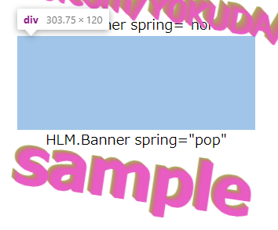
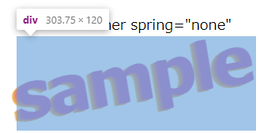

# react-hlm

react-hlmというコンポーネントを開発しました。  
Reactでこんな感じに文字を表示できます。  
  
リポジトリ : https://github.com/Y0KUDA/react-hlm  
デモページ : https://y0kuda.github.io/react-hlm/index.html  
NPM : https://www.npmjs.com/package/react-hlm  

名前の由来はタイトルの通りホットラインマイアミです。  
雰囲気が好きなので、Reactでそれっぽいバナーやテキストを目指しました。  
    
    

# 使い方
npmで公開しているので`npm`や`yarn`で`react-hlm`をインストールすれば使えます。  
こんな感じのコードで簡単にバナーを出せます。  

```typescript
<HLM.Banner text="sample"/>
```

詳しくはリポジトリを参照してください。  

種類も色々作りました。  


# 技術的な話
## 立体に表示する方法
エレメントの高さを0にすることで、同じ場所に複数のテキストを表示することができます。  
少しずつずらして表示することで3Dっぽく表示してます。

```typescript
{Array.from(Array(layers).keys()).map(layer=>{
  return  <div  key={layer+"_key"} 
                style={Object.assign({top:`calc(${vecY*layer*distance}px - ${elementHeight}px )`,
                                      left:vecX*layer*distance,
                                      position:"relative",
                                      height:"0", //　高さが0
                                      color:acid(time*colorSpeed+layer*0.1),
                                      zIndex:layer},style)}>
            {text}
          </div>
})}
```

## 正しい領域を設定する方法
立体表示をするためにエレメントの高さを0にしてしまっているので、そのままだと領域がおかしくなってしまいます。  
今回は同じテキストのエレメントを非表示で作成し、その領域内にずらして入れ込むことで領域を設定しています。  

まず、以下のコードで何も表示しない領域を作成します。  

```typescript
<div style={{visibility:"hidden"}} ref={ref}> // visibility:"hidden" にすると表示されない。
                                              // ref={ref} とすると、refからエレメントを参照できる。
{text}
</div>
```
すると、こんな感じの領域が発生します。  


次に、以下のコードでエレメントの高さを取得します。  

```typescript
    useEffect(() => {
      setElementHeight(ref.current.offsetHeight); // refからエレメントの高さを取得し、設定。
      window.addEventListener('resize', ()=>setElementHeight(ref.current.offsetHeight)); // ウインドウがリサイズされたときに高さが更新されるようにイベントを設定。
      const id = setInterval(() => {
        updateTime(t => t + 50);
      }, 50);
      return () => {
        clearInterval(id);
      };
    },[]);
```

最後に、取得した高さ分を差し引いて表示するようにします。  

```typescript
{Array.from(Array(layers).keys()).map(layer=>{
  return  <div  key={layer+"_key"} 
                style={Object.assign({top:`calc(${vecY*layer*distance}px - ${elementHeight}px )`, // - ${elementHeight}px で必要な高さを差し引く。
                                      left:vecX*layer*distance,
                                      position:"relative",
                                      height:"0",
                                      color:acid(time*colorSpeed+layer*0.1),
                                      zIndex:layer},style)}>
            {text}
          </div>
})}
```

いい感じに収まりました。  
