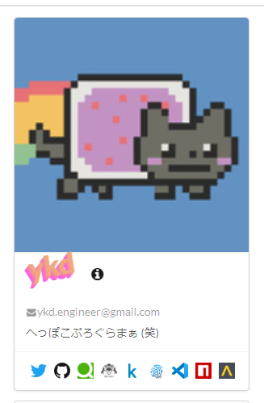

# 経緯
私のブログの右側に表示しているこれ  
  
実装としては表示時にメッセージや名前、各種リンクを外部からパラメータとして与えることができるようになっている。  
つまり、graphqlから持ってきた情報をパラメータとして一つずつコンポーネントに渡す必要がある。  
自分以外のカードを表示することなんてないし固定の情報を表示する静的なコンポーネントにしたかった。

# 解決方法
`useStaticQuery`を使うことで、graphqlを使って情報にアクセスすることができる。

```typescript
import { Link, useStaticQuery, graphql } from "gatsby";
////////////////////////////////////////////
////////////////////////////////////////////
////////////////////////////////////////////
const MyCard = () => {
  const data = useStaticQuery(graphql`
    query MyCardQuery {
      authorJson {
        atcoder
        bio
        email
        github
        id
        kaggle
        lapras
        npm
        qiita
        twitter
        vsmarket
        teratail
        avatar {
          children {
            ... on ImageSharp {
              fixed(width: 150, height: 150, quality: 100) {
                src
                srcSet
              }
            }
          }
        }
      }
    }
  `);
  const avatar = data.authorJson.avatar.children[0];
  return <MyCardProp
      avatar={avatar.fixed.srcSet}
      id={data.authorJson.id}
      bio={data.authorJson.bio}
      email={data.authorJson.email}
      twitter={data.authorJson.twitter}
      github={data.authorJson.github}
      qiita={data.authorJson.qiita}
      atcoder={data.authorJson.atcoder}
      kaggle={data.authorJson.kaggle}
      lapras={data.authorJson.lapras}
      vsmarket={data.authorJson.vsmarket}
      npm={data.authorJson.npm}
      teratail={data.authorJson.teratail}
    />;
};

```
