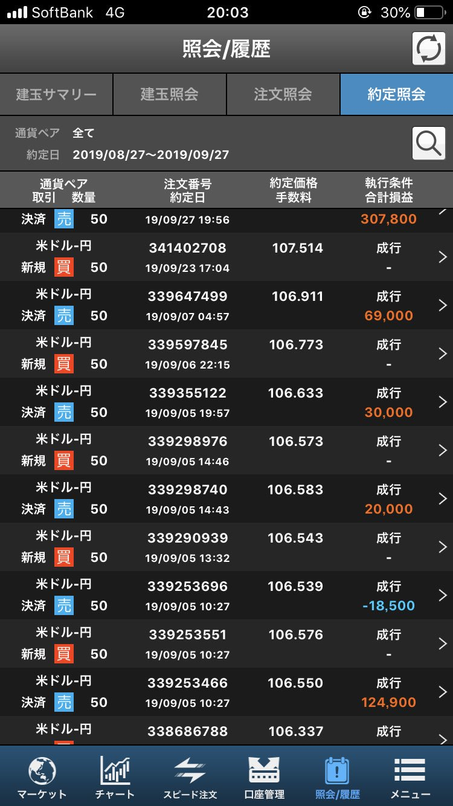
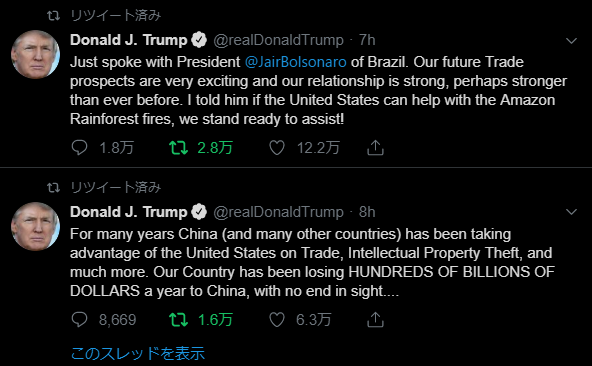

   
とあるトレーダーの命の輝き。

## 2019/9/29
今月頭から書き続けてる転職の記事がやっと書き終わりそう・・・  
FXネタで色々書きたいことあるけど、転職記事にかなり手こずってしまった。まあ、ネタストックがあることはいいことや。  
先月には劣るけど、今月もなんとか+50万円でエンジニアの収入と合わせるとギリギリ年収1000万円に乗る成績なので安堵。  
最終週の売買で30万なので、この波にのれたことが勝因ですな。  
今回は画像を晒してしまいまおう。今まで晒さなかった理由は、取引のサイズを見られるのが恥ずかしかったからなんや。俺は、取引のサイズはちんちんの大きさに通づるものがあると思ってる。つまり小さいと恥ずかしい。俺の取引は基本的にドル円50万通貨ロングのみ。ちんちんの大きさに換算すると11cmぐらいじゃないかな。短小ｗ  
  
ちなみに、月曜日はドルが下がると思うからポジションは持ってないよ。充分下がってからまたドルロングエントリーする予定。  
目指せ、億り人。

## 2019/9/7
月収100万ニートから月収35万正社員にクラスアップしたせいで、忙しみが半端ない・・・  
今月の運用成績は、なかなかに厳しい滑り出し。月始めの予想が外れてにいきなり大損失からのスタート。  
予想が外れることなんか、そりゃぁあるだろうけど月始めにマイナスからのスタートというのはなかなかつらいんだ。  
色々な損失が積み重なった結果だけど、一番の原因は米中協議が決まったことでドルが値上がりしたタイミングでのドル売りが早すぎたこと。あそこでの逸失利益が半端ない・・・  
紆余曲折有りつつも、現在なんとかプラマイゼロ。  
ストレスで肌環境がやばいwww  

あと、先月作ってた記事やっと出せるｗｗｗ  
正社員忙しすぎるｗ  
[【FX】ぼくのかんがえたさいきょうのトレーディングストラテジ【最強】](./2019-08-28--trading-strategy-no-rain-never-stop/)

## 2019/8/27
今日は平和な一日でした。  
平和すぎたのでスキャルピングの検証してみました。  
[【2時間】スキャルピングしてみた【14回】](../2019-08-28--super-scalping/)  
遊びでスキャルピングに手を出した男の末路を見てください・・・  

## 2019/8/26
今回は辛い戦いでした・・・  
結論から言うと、大勝を納めることができました。  
先週の金曜日に中国副首相がアメリカに対して関税をかけると発言し、土曜日にトランプおじさんがツイッターで中国を煽りました。  
金曜日の時点で私は、ここが底値と思って大量にドルを仕込んでいたので、土曜日のトランプ氏のツイートには心底ヒヤヒヤしていました・・・  
そしたら、月曜日、なんとドル104円台に突入ですよｗ  
金曜日の時点でも最悪104円台ぐらいまで落ち込むだろうなとは思っていましたが、実際そこまで落ち込むと「うわぁ・・・これ以上落ち込んだらどうしよう・・・」と思わずにはいられませんでした。  
この時点で、私の損失は資金に対して20%ほどに膨れ上がっていました。リアルにFXで有り金全部溶かした人の顔をしていました。  
  
まあ、追証用のキャッシュはあるんですけどね。  
そういう理由で、他の人より落ち着いて見守ることができたことも今回の勝因だと思います。  
そして、お昼ごろに中国副首相が貿易戦争解決を望む発言をしたんですね。これがきっかけでドルがちょっとぶり返しました。    
[【速報】中国副首相「貿易戦争エスカレート反対」　「米中にも世界にも不利益」](https://www.fnn.jp/posts/00422959CX/201908261144_CX_CX)  
でも上がったのは一瞬だけで、すぐちょっと前の水準まで押し戻されるんですね。せっかく見えた勝機がじわじわ消えていく様子に正直グロッキーでした。  
どうせトランプおじさんがポジティブな反応をするだろうと予想していたので、あえてこのタイミングで買いを入れました。  
この予想は一応あたって、利益に繋がりました。  
[米中貿易戦争に緊張緩和の兆し、トランプ氏が交渉再開に言及](https://www.afpbb.com/articles/-/3241489)  

## 2019/8/24
FXを始めて2週間が経過しました。  
戦略とか特になしで野生の勘に従ってトレーディングしていますが、毎週10%のキャピタルゲインを得ることができています。  
強いて言うならプラスになるまでポジションを持ち続けるという超絶脳筋プレイで何とか勝ち続けることができています。  
とは言いつつも、今週末の中国がアメリカに対して関税かける云々のニュースで相場が大暴れしたときは損切とポジションチェンジで華麗に利益を確保することができました。  
今まで遊びでやってたFXですが、これを機に資金配分を増やそうと思い手元にあった諭吉さんたちを戦場に送り出してきました。  

  

諭吉さんたちはここで旅立っていきました。  
レバレッジはかなり低めなので、リーマンショックが来ても大丈夫でしょう。  

あぁ、月曜日が楽しみだと思っていたら土曜日、トランプ氏が何やらトゥイートしてますね。
  
あぁ、チャイナとアメリカバチバチやん、もうどうにでもなぁれ。  

あと、いつでもトレードできるように携帯にアプリを入れましたがワンタップで取引できるこれ便利ですね。  
でも昨日寝不足でボタン間違えて10万円吹き飛びました。これは流石に人権を失うレベルのミスですね。猛省してこれから気を付けねば。  

