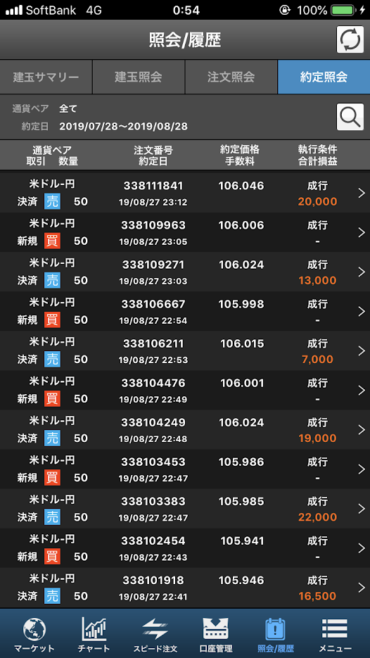
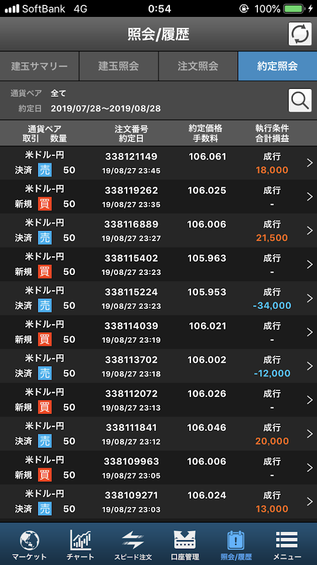

自分のスキャルピング能力と、スキャルピングによってどのぐらい稼げるのか気になったので実際に「2時間鬼のようにスキャルピング」をしてみた。  

# 条件  
通貨 : ドル円  
日時 : 2019/8/28  21:33 - 23:45  
単位 : 50万通貨  
私のスペック : FX歴1ヶ月  

# 計算方法  
2019/8/28 21:33 に50万ドル購入、2019/8/28 23:45に50万ドル売却した際の売買益を「スキャルピングしなかった際の利益」とし、実際の成績と比較し、どれだけプラスもしくはマイナスがあるのかを検証する。  

# 結果  
スキャルピングしなかった場合、
2019/8/28 21:33 時点で105.796円/ドル  
2019/8/28 23:45 時点で106.070円/ ドル  
差額は0.274。つまり、50万通貨売買した際の売買益は13.7万円。

2時間で14回スキャルピングした場合、利益は14.27万円。  

うーん、こんだけ頑張って差額は0.57万円か・・・  
時給にすると3000円・・・あほくさｗ俺は奴隷かよｗ  
でも割合にすると4%。馬鹿にできないけどトレードしてる額が小さいからなぁ。  

以下4点を調整すると、もう少し結果は良くなるのかな。  
* 途中で南アフリカランドを間違えて買ってしまってそれで0.28万円の損失が出てしまった。  
* 「スキャルピングしなかった際の利益」は最安値から最高値の差額で計算している。  
* スプレッドは0.003円なので証券会社に合計2.1万円払っている。  
* 人と話しながらトレーディングしていた。  

なんにしろ、良くて10%でしょう。  
うーん、微妙ｗ  

# 最後に  
こういう実験的なことをやるのであれば、MetaTraderや仮想取引でやればいいという意見もあると思いますが、実際にお金がかかっているトレーディングとかかっていないトレーディングは全く違うものになります。今回の企画では、よりリアリティを追求するために50万通貨を用いてやってみました。  
また、今回2時間しかやってない、かつセッティングがガバガバなので結果と実際の実力には大きな乖離があると思います。なので、こういう企画は時間があるときにまた何度かやっていこうと思います。  
時間が作れたら24時間耐久とかもやってみようかなｗ  

最後にトレードの詳細を貼っておきます。  
## トレード詳細
　　  
  
  
最後の方の大爆死が悔やまれる・・・  

