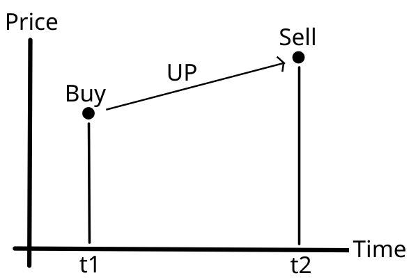
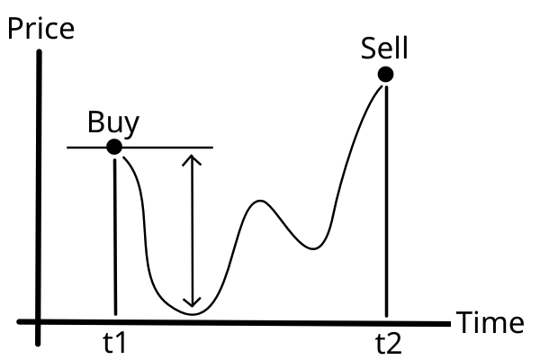
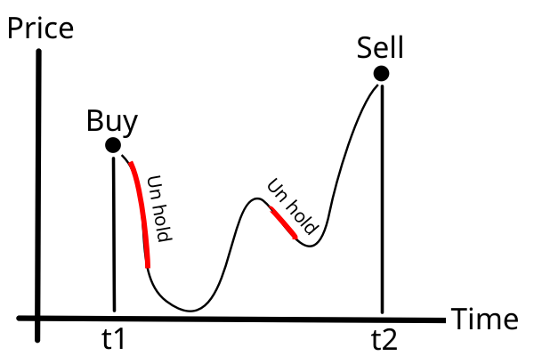
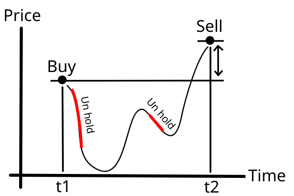

価値が上がるまでホールドし続ければ必勝、そう思っていた時期が俺にもありました。  
最近僕がFXで実践しているトレーディングストラテジ「止まない雨はないさ戦法」について書きます。  
トレーディングに伴う精神的苦痛および、それによりもたらされる膨大な損失を軽減することが目標です。  
ドル円のトレードで利用することを想定しています、条件を満たせば様々な市場に応用可能です。  
FX歴一ヶ月の僕が編み出して一週間ぐらい実際に売買してみてうまくいってる方法です。信頼性に難ありです。  

# メリット
* ウデマエ、損益の評価が簡単  
* 損切に伴う精神的苦痛がない  
* 空いた時間に売買可能  

# 前提条件
* 気長に待っていれば、いつかエントリーしたときより高く売れるものを選ぶ(デフォルトや破綻しないもの)  
  
新興国通貨とかジャンク系は向きません。  
  
* レバレッジは予測される最低値を耐えきることができる程度にかけること。  
  

# 最初に買ってから最後に売り抜けるまでの間にやること
1. 価値が上がっている間はホールド。何がなんでもホールド。  
2. *1.*を確実に守りながら、価値が下がっている間は可能な限り手放す。  
  
## 何が起きるか
最終的にアンホールドして損失回避したpips分と最初と最後のpips分が利益になる。  
  

例えば、途中で105.100円でドルを手放して105.000円で買い戻した場合、0.100円分の利益を得たものとして考えます。(必ず価格が上昇するという仮定により。)  

# コツ
* ドル円だと5-10倍ぐらいのレバレッジがいいかも。  
* とにかく、上昇中はホールドすること。  
* 睡眠中はスワップ狙いでホールドがおすすめ。確実に下落が読めるならアンホールドもあり。上がるも八卦上がらぬも八卦ならホールドがベター。  
* ショートは禁忌 : ショートを織り交ぜてトレーディングすると精神的苦痛が4倍になります。試しにやってみるとわかります。やめといたほうがいいです。もしやるなら、取引量分をショートして二倍の取引量を売り買いすることで、うまいことポジションをトグルできます。
* 失敗を取り返そうとしない : 何度それで傷口を広げたか思い出し、謙虚に負けを認めることが肝要です。最後に立っていれば勝利です。リセットして次の最善の一手を探ってください。(自分に言い聞かせてる・・・)  
* 定期的にウデマエを評価すること。 

# 売買損益 / ウデマエの評価
ある期間t1からt2までの売買損益は以下の式で計算します。  
売買損益 = 実際のトレーディングによる損益 - (t1で買い、t2で売った場合の損益)  
この値がマイナスだった場合、放置しておいたほうが良かったということになります。辛いですね・・・  
常にプラスを叩き出せるように頑張ろう・・・  
※もし、実際の損益がマイナスでも、売買損益がプラスであればその利益は将来的に必ず取り返すことができます。(前提条件より。)  

ウデマエは以下の式で評価します。  
ウデマエ = 売買損益評価 / (t2-t1)　　　　  
売買損益評価を時間で割っただけです。言わばあなたの時給です。現時点での私の時給は2万円です。

