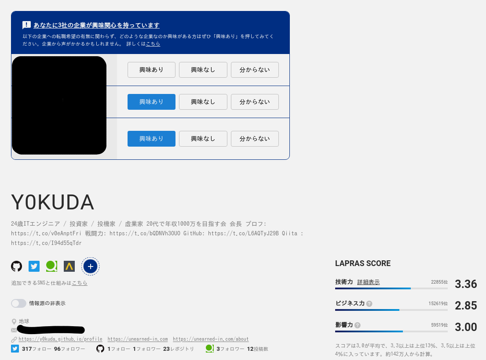

新卒で入った会社を一年で辞めて転職した話です。  
前職やめて長らく無職だったけど、最近就職してちょっと落ち着いたから経緯とか結果とか色々まとめてみようと思います。  
就活生や、転職を考えている新卒2年目の人たちのお役に立てば幸いです。  

転職活動の規模はこんな感じです。  
* 利用した転職支援サービス -> 10以上
* 書類エントリーした会社 -> 100社以上
* 面接を受けた会社 -> 20社以上
* 内定 -> 10以上

一応私のスペックも書いておきます。
* 新卒一年目(当時)エンジニア
* 四年制大学の情報系学科を学部で卒業 (偏差値はギリギリ50行くか行かないかぐらいｗ)
* スキル -> このブログの[aboutページ](../../about/)とか[LAPRAS](https://lapras.com/public/ASZLKRT)を参考にしてください。
* 属性 -> 意識高い系イキリプログラマ  
* 思想 -> ちょっと左寄りのガチ資本主義

本記事は3つに分かれてます。
* [転職してみた -退職編-](../2019-09-30--job-fired/)
* [転職してみた -ニート生活編-](../2019-09-30--job-neet/)
* [転職してみた -職探し編-](../2019-09-30--job-finding/)   <- イマココ

ここでは面接を受けた会社やオファー、どのように会社を探したかなど転職活動について書いていきます。

# 転職で叶えたかったこと
  
正直、転職活動を始めた頃はあまり固まってなかった部分がありますが、多くの企業を見て自らの目指したいキャリアのイメージがなんとなく形成されていきました。  
今回の転職で実現したかったことは色々ありますが、結局の所全て金に帰結します。  
私は金が大好きなのです。さっさと金利だけで生活していけるような貴族になりたいのです。  
ということで、具体的にはこの3つを意識していました。
* 条件のアップ
* 将来的に稼げそうな技術、ビジネスが学べる
* 幅広い技術を学べる : 単価の高いCTOとかスーパーフリーランス枠を狙うとなると必要。

## 逆に避けてたもの
* 今後廃って行きそうな技術 : CobolとかJavaとかPHPとか。  
* SES : いくつか受けたのですが条件が良くなかったので後半は避けてました。
* 給与が年功序列 : やる気出ないですよね・・・
* 一つの案件につきっきりになる : 飽きるし、技術がたまらない。

# 試した方法
  
職探しの方法として試した方法はこんな感じです。
* 転職エージェント
* 転職サービス (非エージェント)
* ハローワーク
* LAPRAS
* Twitter  

それぞれについてどんな感じか、どう利用していたかを書いて行きます。

## 転職エージェント
まずは、転職エージェントに一通り登録してみました。  
企業探し、面接のスケジューリング、折衝など面倒なこと全て面倒を見てくれるので便利ですね。  
転職エージェントという存在を一言で表すと、転職に関する面倒を見てくれる秘書みたいなものです。  
転職したことがなくて、何もわからないという方はまずエージェントを探すといいでしょう。  

私が今回利用したエージェントはこちらです。
* アデコ Spring転職エージェント
* ワークポート
* テッククリップス
* リクナビエージェントエージェント
* マイナビエージェント
* doda
* ギークリー
* その他 (4社)  

上4つのエージェントは特によく利用していました。  

### サービス利用の流れ
サービスによって利用までの流れは違いますが、だいたいこんな感じです。
1. 登録フォームから個人情報、希望年収や就きたい職業を登録。職務経歴書、履歴書をアップロードする。
2. 担当のエージェントが一人付き、電話越しもしくは事務所で直接ヒアリングを行う。
3. 「この会社どうですか？」といくつかお勧めされる。
4. 「受けたいです」というと書類エントリーしてくれる。
5. 書類が通ると面接日時のセッティングをしてくれる。
6. 内定後、条件の折衝などをしてもらうこともできる。

### 感想・アドバイス
#### お勧めのサービスについて
担当者が自分に合うか、業界に詳しい人か、が8割だと思うのでどこのエージェントがお勧めかということは書きません。  
いくつか登録してみて自分により合うエージェントを利用することをお勧めします。  
自分の場合、ITにあまり詳しくない人が担当についてしまって「あらま・・・」って感じであまり利用しなかったエージェントがいくつかあります。IT系の転職を目指しているのであれば、IT系が得意なことをアピールしているサービスがいくつかあるのでそういうところから優先的に登録してくといいでしょう。  
ワークポートやリクルートエージェント、アデコは「xx社は最終面接でこういうことを聞いてくるよ」や「試験はこういう内容が多いよ」みたいに具体的なアドバイスをしてくれました。

#### 欠点・・・？
日程の調節や条件の折衝など色々と面倒を見てくれるのは大変ありがたいですが、一説によると企業がエージェントに支払う手数料(年収の3割〜5割らしい)が発生する分、採用の基準が上がることがあるそうです。自分は質より量派なので気にせずどんどん利用していました。ガチ本命がある場合は個人でエントリーしたほうがいいかもしれません。  
逆に、そもそも全くエージェントを利用する気が無い人でも、業界の話を聞けたり、職務経歴書や履歴書の添削をしてくれるという利点があるので一度相談してみるのもありだと思います。  

#### 謎のSES礼賛
転職エージェントの全体的な特徴として、やたらとSESを推してくるということがありました・・・  
エージェントからすれば、報酬を得るために入りやすい会社に早く入れてしまいたいという動機があるのかもしれません。  
私はそう考えていたので、エージェントの耳障りのいいSES礼賛にはバイアスを掛けて耳に入れてました。  
実際のところどうなんでしょうか。他のエージェント利用者にもぜひ話を聞いてみたいですね。  

#### オワハラ！？
「早く決めろ」「会社はまってくれねーぞ」と、やたら詰めてくるエージェントもいくつかありました。  
恐らく「目移りして別の所に行く前に、さっさと自分の紹介した会社に入ってほしい」という事情からだろうと思っています。    
「xx社から○○日までに返答が求められています。」というエージェントの言葉が本当なのか？実は勝手に言ってるだけじゃないのか？と思って検証したことがあります。  
ある会社から内定をもらった際に、一ヶ月以内に返事がほしいと言われました。その後、エージェントから「返答期限の指定があったか」と聞かれましたが「返答期限については話さなかった」と答えました。後日、エージェントから「xx社から一週間以内に返事がほしいと言われている」と伝えられました。これは、エージェントが勝手に期限を縮めている可能性が高いのではないでしょうか。  

#### ウラワザ : 返答期限を伸ばす方法
一番無難なのは「○○について、まだ不安なので面談で社員と話をしてみたい」という申し出をすることです。もし、面談が決定すれば当然、内定の返事はこの面談が行われる日程の後になります。私の場合、期限を伸ばすためではなく入社を考えている会社はほとんど社員面談をセッティングしてもらっていました。情報量は多いに越したことはないので。ちなみに、申し出れば9割ほどの確率でセッティングしてくれました。  
もう一つは、先述の「エージェントが勝手に期限を決めている」パターンに有効な方法です。エージェントに「どうしても期限を伸ばすことが無理そうなら、自分が直接xx社の人事の○○さんに交渉します」と申し出ます。エージェントからすれば、そんなことをされるとたまったものではないので「私が交渉するから、直接連絡するのはやめてくれ」と言ってきます。本当に交渉したかどうかは分かりませんが、自分の場合はこれで返答期限が伸びました。  

#### エージェントによって通りにくかったり通りやすかったりがあるかも
あるエージェントを利用した際に解せない思いをしたことがあります。  
エージェントを挟まないタイプの転職サービスに、とある企業から「うちに面接に来ませんか」というお誘いが来ていたのですが、企業とやり取りするのが面倒くさかったので別のサービスのエージェントにエントリーをお願いしました。  
すると、書類落ちしてしまいました。  
職務経歴書、履歴書を見て「面接に来ませんか」と言ってくれてたはずなのに、エージェントを挟んでエントリーすると書類落ちしました。  
先述の"エージェント挟むとハードルが上がる理論"が作用した可能性もありますが、エージェントの能力が原因の可能性もあります。サンプル数が少ないのでなんとも言えませんが、エージェントによって通りやすい、通りにくいがあるかもしれないので複数のエージェントを利用することでリスクヘッジするのもアリだと思います。逆に、このエージェント利用するとだいたい書類通る、みたいな凄腕エージェントにあたったら幸運なんですけどね。  
私が複数のエージェントを利用していたのはこれも理由の一つです。ただ、日程の調節はかなり面倒くさかったです。せっかくエージェントを利用しているのに大きな利点を潰してしまうという諸刃の剣です。  

## 転職サービス (非エージェント)
私は、エージェントを介さないタイプの転職サービスも利用していましたが、面倒くさがり屋なので最終的なエントリーはほとんどエージェントにお願いしていました。  

今回、私はこれらの非エージェント転職サービスを利用していました。
*  マイナビ
*  リクナビ / リクナビネクスト
*  doda  

マイナビ、リクナビ、dodaはエージェントサービスと繋がっていたので、同じサービスになるかもしれません。

###　感想・アドバイス
AIが傾向を見てレコメンドしてくれる機能や企業からオファーが来るものもあります。あまり、レコメンドが合っていた印象はありませんが・・・  
このサービスが特出してすごいというものもなく、どれも似たりよったりに感じました。  
とりあえず、データベースとして利用するならリクナビ、マイナビに登録しておけばいいのでは無いでしょうか。  
やたら大量の「ここ受けませんか」メールを送ってくるサービスがあって、初めの方は読んでたんですがだんだん読まなくなっちゃいましたね。

## ハローワーク
失業保険の手続きで定期的に訪れていたので、ついでに転職支援も受けていました。自分の通っていたハローワークでは担当者がついてくれて、面接のアドバイス、履歴書の添削、職探しなど色々なサポートをしてくれました。無料でここまでのサービスが受けられるのはやばいと思います。日本すごいですねｗｗ  
でも正直なところ、民間のエージェントサービスの方が専門知識や業界知識に詳しいし、レコメンドのレベルが高いように感じました。ハロワの担当者はJavascriptとJavaを一緒にしていたり、リモートワークとサーバへのリモート接続を一緒にしていたりということがありました・・・  
求人の掲載も無料なので民間の転職サービスと違って玉石混交率が高くなってしまいますが、IT門外漢の話を聞いてみることにも意味があるかと思って利用していました。  
実際に、エントリーもしてみましたが少なくとも自分が受けた所はオファーの条件も良かったのでそれなりのリテラシーさえあれば有用なサービスだと思います。ただ、優先度はあまり高くありません。余力があれば利用するぐらいでいいと思います。  
### 就労支援
失業保険を受けている人は、ハローワークからスクールや講座に申し込むことができます。  
ハローワークから申し込むメリットはこの二点が大きいです。
* 無料で受けることができる
* スクールに通っている間、失業保険を継続して受けることができる  

デメリットは特にありませんが、あえて挙げるとすればこの二点です。
* ハローワーク指定のものしか受けることができない
* それほどレベルの高いものは用意されていない

上記のメリットがかなり大きかったので、当初は自分も検討していたのですが講座のレベルがそんなに高くなかったので見送りました。WordPressを使ってWebサイトを作る内容だったのですが、卒業生のポートフォリオを見る限り講座を受けなくても作れるかな、と思えるレベルのものでした。受講生もIT初心者が多くて情報系の学科を卒業した人がわざわざ受けるものでもないなぁという印象でした。そもそも、何にもできない人がなんとか職に就くための支援なので、それほどハイレベルなものが用意されているはずがありませんね。
#### 過保護な国
日本は何にもできない人に対して超優しい国だなぁと思うわけです。別に日本を褒めちぎるわけではなく、むしろ過保護すぎる所をディスっています。もし失業保険なんてなければ、私は仕事をやめてからだらだらギャンブルやFXにうつつを抜かすことなくすぐに働き始めていたでしょう。「でもお前、失業保険受けてるじゃん」という意見もあるでしょうが、それは損したくないから受けていただけです。働かずに、ちょっと就職活動するだけで必死こいてバイトするのと同じぐらいのお金がもらえるものですから。こういうのをモラル・ハザードと言うのでしょう。つくづく自分はモラルの無い人間だなぁと反省はしていますが、行動を変えようとは思わないのです。ノブレスオブリージュという言葉に従い、私も金持ち貴族なったらモラルのある行動を取ります。  

## LAPRAS
自分の戦闘力が数値化されて出てくるやつです。  
僕のやつはこれです[LAPRAS](https://lapras.com/public/ASZLKRT)。  
数値化できることが面白くて登録していただけなので、初期は職探しに全く使ってませんでしたが下の画像みたいな感じで合計5社から連絡があったのでそのうち3社と実際に話をしてみました。  
あまり、ミスマッチを感じたことがなかったので流石だなと思いました。  
  

LAPRASのいい所は、自分からの応募ではなく向こうからオファーしてくれるところです。  
自分の労力がほとんど必要ないので「いい企業が自分に興味を持ってくれてたらラッキー」みたいな感覚で利用するのがお勧めです。さらにGitHubやQiitaと紐付いていて、おまけに能力が数値化されているのでミスマッチが起きにくいというのもなかなかイケてます。  
LAPRASのみで転職を実現させるのはリスキーなのでお勧めはしませんが、十分可能だと思います。  

## Twitter転職
Twitterでハッシュタグ #Twitter転職 をつけてつぶやくだけです。  
活動自体は超簡単です。  
フォロワー100人に満たない僕が5回ほどつぶやいただけで、3社から直接連絡がきました。  
これもコストがかからないので当たったらラッキーぐらいの気持ちでやってみるといいかもしれません。  
普段から「おっぱいおっぱい」つぶやいてる人は垢バレしている状況で面接を受ける胆力が必要です。覚悟しましょう。  
転職エージェントからはめちゃくちゃ連絡が来ます。転職エージェントは小さい会社含めると星の数ほどあるってことがわかりました。そりゃぁ、月1人、2人入社させるだけでかなり儲かる仕事だからなぁ・・・  
俺も、現職やめたらフリーランスで転職支援事業はじめようかな。  
Twitter転職で出会う会社やエージェントはかなり玉石混交率が高いので、ガチャと割り切ることが大事です。普通に詐欺っぽいのもあるしMLMも来ます。  
まあ、それはフォロワー100未満の一般人の話であって、フォロワーがオーバー5000ぐらいになってくると話は変わってくるんだろうと思います。だってそこまで行くとインフルエンサーだし、ち○まど枠とか狙えますね。  
↓こんな感じのをつぶやけばOK  
     

## 次転職するときに利用してみたいサービス
最後に、備忘録的に今回利用しなかったけど利用してみたいサービスをまとめておきます。
* Bizreach : なんかやたらCMしてるけどどうなんだろう
* Wantedly : LinkedInと何が違うんだろう
* LinkedIn : 言わずとしれたビジネス系SNS

# 面接を受けた会社とオファー (抜粋)
  
IT業界にあまり詳しくなかったのと、自分の市場価値を知りたかったのでかなりたくさん業界、業種を問わず受けてました。  
オファー内容とか書いてる関係で社名は伏せます。  
オファーは諸々手当込の額面です。  

## SES
いくつか受けてみてオファーをもらいましたが、全体的に給与が安かったのと昇給ペースが遅そうなので就職活動終盤は避けてました。手取り300万円下回るのとか普通にあります。どうやって生きろと？というか、それ以前に俺はこの仕事をするために300万円と4年間を投じてるんやぞ、ちょっと馬鹿にし過ぎなので・・・いや、言い過ぎた。やめておこう。    
「xxxな仕事とかxxxみたいな業務をやりたいです。」って面接で具体的に話したのにかなりイメージと違うポジションのオファーをもらったり、イマイチなのが多かったです。「機械学習やりてー。やらせてくれるなら入社を検討しますお。」って言ったらオファー面談に呼び出されて、蓋を開けてみると全く関係ない組み込み系のポジションだったり。「まずはここに配属するけど、将来的には君がやりたいプロジェクトにアサインするよ」って言ってくれてはいたんですが、うーん、これで入社すると思ったのかな。  
オファー条件 : 280 - 320 万円 / 年  

### 一言アドバイス
SESの給与形態には2種類あります。「案件の単価に比例するタイプ」と「職能に比例するタイプ」です。この給与の性質も判断基準に加えるべきです。給与だけでなく、形成されるキャリアも大きく変わってくると思いますので、まじで重要だと思います。

## SES(データサイエンティスト)
SESで未経験のデータサイエンティストの募集があったので調査を兼ねて受けてみました。やはり、未経験ということもあり給与もそれなりでした。面白そうな職種ではありますが狭く深くが求められる職種なので、自分の性格だと永遠にガチ勢に勝てないと思いやめました。私は広く浅く、一部チョット深く型です。  
もしガチっても、数学系出身のガチ勢と対等にやりあうには年単位で数学分野の勉強時間が必要でしょう。ちなみに、その会社のデータサイエンティストの高給取りは年収800万円らしいです。  
最近、未経験Webエンジニアが流行ってますが、そういう層の人たちがキャリアごと食い潰されているような気がしています。もしかすると、例にもれず未経験データサイエンティストもそうなんじゃないかという不安があります。一部のキラキラ高給取りにホイホイつられて行き着く先は雑用係だったら嫌だなぁと思ってます。だから、この条件だと未経験データサイエンティストというリスキーなキャリアは取れません。最低500万は出してほしいですね。  
オファー条件 : 320 万円 / 年

## ガチ機械学習・データサイエンス系
Twitter転職で声をかけてくださった会社があったので面接を受けてみました。ベンチャーですが、社長が論文書いているガチの人なのでこの環境だと一点突破型キャリアも有りかなと考えて結構真剣に考えていました。わざわざ、金融工学の本買って勉強したぐらいには真剣に考えてました。あと、給料も良かったし。    
でも、第二面接を受けた後の連絡が来ない・・・  
面接が終わった後に「できるだけ早く連絡するね」って言ってたのに。仮に、お祈りだとしても連絡しないのはいかがなものかと思います。実際は「他にいい人が面接受けにきたからとりあえず返事はせずにキープしといたれ」ってことが起きていたと予想していますが、真相は闇の中です。  
ちなみに、内定を出す場合は520万円/年でオファーするよって言われてました。  

## 出版・エンタメ系企業
出版会社には全く興味がなかったのですが、その企業はエンタメ系も手広くやっていて面白そうだったので受けてみました。面接を通して色々話を聞いてみて良さげだったので、オファーをもらったあとに社員面談を組んでもらいました。使っている技術やビジネスの幅が広くてかなり求めている環境に近かったです。  
断った理由は給与形態に年功序列を若干感じたことと、残業が多かったことです。特に残業に関しては面接のときに「エンジニアは残業少ないよ」と聞いていたのですが、「数字で見せてもらえますか？」と頼んで見せてもらうとそうでもなかったので多少不信感が生まれました。  
とは言っても事業や技術スタックの幅広さや代謝はかなり良さげだったので転職活動中の知り合いや新卒にお勧めしたい企業の一つです。ここで企業名を公開できないのが悲しいですね。  
オファー条件 : 420 万円 / 年

## 転職エージェント
利用していた転職エージェントから直々に「うちはどうですか」とお誘いいただきました。  
まさかこんなことが起こるとは思っていなかったので驚きましたが、こういうイベントはエンジニア冥利に尽きますね。「君に可能性を感じる！うちはどうだい？」かなりしびれました。  
実際に話してみた印象は社長の理念がかなり強くて、なんと言うかいい人過ぎて自己犠牲すら感じました。端的に感想を言うと、自分の汚さが目立ってやべぇなと。社員もみんなキラキラしてていい人なんです。  
その会社のエージェントのサービスも本当に素晴らしかったし、手がけている他のサービスにも興味があったのですが、どうしても理念的な部分で自分に合うかなぁ・・・という不安が大きかった。ここで働くには自分は汚れすぎていたと思います・・・  
エージェントのサービスは本当に良かったので知り合いには勧めまくってます。  

## 請負開発(知人紹介)
Twitterで知り合った方に紹介していただいた会社です。恐らく、社長が人脈の広さを活かして幅広い業界でビジネス展開をしてるタイプの会社さんだと思います。技術やビジネスのスキルを伸ばしていける環境だと思いました。条件もめちゃくちゃいいですし、かなり悩んだ末に、現職の会社を選びました。苦渋の決断ですね。体が2つあればいいのに。  
なんとかこの会社に関わっていきたいと思って契約社員で月90 - 120時間稼働ぐらいで雇ってくれないかお願いしてみたんですけど、私のスキルが低すぎてむりぽでした。悲しいですね・・・  
オファー条件 : 500 万円 / 年

## Eコマース系企業
そこそこ大きい東証1部上場企業。条件はめちゃくちゃ良かったです。みなし残業代がないから、普通に年収500ぐらい行くと思います。420でオファーもらったんですが、よくよく話を聞くと色々な手当があって家賃補助含めると450ぐらいになります。  
断った理由は、前職と同じ結果になるのではないかという懸念があったからです。技術もほぼPythonらしくて、飽きそうだなぁと思いました。クラウドをバリバリ使っていたので、クラウド万能マンというキャリアを同時に目指すのもありかと思ったんですが、やっている事業が一つに絞られているので、自分にとって少し窮屈かなぁと思ってやっぱりやめました。  
恐らくこの会社に入社することは、将来の収入という観点でも良いキャリアだとは思います。  
お勧めできる要素は多分にあるので、知り合いにはお勧めしていこうかなと思います。  
オファー条件 : 450 万円 / 年

## 研究系
大学と何かを開発したりする系の研究室っぽい企業があって、面白そうだったので面接を受けてみました。  
論文をコードに落とし込んだり、ハードウェアを作ったりやってるらしいです。面白そう度は高かったけど、向かう所が理想と少しずれそうだからやめました。あと、平均年齢が50ぐらいで面接受けた幹部全員の名刺にPh.D.と書かれてました。学科卒の自分は出世できなさそうだなぁとか思いました。  
オファー条件 : 400 万円 / 年

## メーカー系
特殊なマシンのソフトウェアを作っている会社を受けてみました。かなりニッチな事業ですが給与は良かったです。ですが、確実にロックインするタイプの仕事だと思ったので断りました。  
オファー条件 : 420 万円 / 年

## データ分析系企業 (現職)
特定されたらやだから何も書かないです。  
ただ、業界を選ばずやっていける事業で触れられる技術も広そうな所が良かったです。理想に一番近かったです。

## 受けた企業とオファーを振り返ってみて
オファー内容は結構ばらつきがありますね。中央値だと400万円/年ぐらいだと思います。  
感覚として、ある程度選んで10社受ければ年収400万円以上のオファーは取れます。  
これをそんなに高いとは思いませんが「大学新卒で入った会社を一年でケツまくって逃げ出したペーペーの転職者」に対する条件だと考えればそんなに悪くはないのではないでしょうか。改めて、IT業界っていいなぁと思います。  
あと、そもそも給与が低そうな所は避けてたり、最終面接に行く前にこちらから断ったりしていたのである程度弾かれているという事情もあります。  
何にしろ、ITは選ばなければ秒で転職できます。  

# 面接質問と僕の実際の返答集
  
面接は、新卒で受けたものとだいぶ違うなという印象を受けました。  
新卒の頃に受けた質問はメンタル的なこととか趣味とかふんわりしたことを一方的に聞かれることが多かったのですが、今回の転職では、技術的な話が8割を占めていました。面接のスタイルも一方的ではなく軽快にやり取りする感じで進むことが多かったです。エンジニアはコミュ障が多いから、技術力とコミュ力を同時に見ているのでしょうか。転職とか関係なく自分の人間性がそういう空間を作り出してしまっていた可能性も否めませんが。新卒でガチガチな面接を受けてきた私にとって転職活動の面接は気が重いものでしたが、むしろ前線で戦ってる色々なエンジニアの話や考え、技術に触れることができる楽しい機会という認識に変わっていました。  
また、新卒は年収が固定の場合が多いですが、中途は希望年収を言うことができます。その点も大きな違いでしょう。

## 質問
### 将来どうなりたいの？
A.「2,3年まではとにかく扱える技術の幅を広げたい。IT業界は流行り廃りが激しいから若い内に吸収力を高めたい。5年までには人を成長させられる人間になりたい。10xエンジニアもいいけど、人を育てた方が加速度的な利益創出に繋がると信じている。10年後ぐらいにはCTOとかコンサルになって稼ぎたい。」
### なんでやめたの？
A.「エンジニアとして成長できなさそうだったから。単純作業が多かった。先輩社員を見てああなるのか、と考えるとちょっと微妙。残業もハードだったけど、前者が理由の8割。」
### 前職で苦労したことは？
A.「計画と進捗が大きく乖離して、かなり残業したこと。」
#### なんで乖離したの？
A.「上司のオーダーはxx週間で〇〇を完成させろだった。私は想定される作業のサイズの比率で無理やり工数を割り振った。故に進捗と計画が乖離した。改善策として、OpenProjectというソフトを使ってWBSの作成と進捗の可視化を行った。事前の相談と、乖離が発生しそうな作業の近くで計画の実現可能性について相談するタイミングを設定することで計画の見直しを計画に盛り込んだ。」
### なぜうちを受けようと思った？
A.「(将来どうなりたいの？の内容)を実現できそうだから。」
### 仕事をする上で大切にしていることは？
A.「(前職で苦労したことは？の内容)ということがあったので、計画性を大事にしてる。」
### どんな仕事にやりがいを感じるか？
A.「何%効率化されたとか、何円利益を生んだとか数字で見える成果が出る仕事。」
### xxx使ったことある？
使ったことがあれば普通に答える。  
なければ、なんとかポジティブにお茶を濁す。  
A.「xxxは使おうと思ったことはるのですが、○○○と聞いたので△△△の方を採用しました。御社ではxxxを採用しているのですね。○○○は実際のところどうですか？」  
通称「それは使ったことないけど、あれは使ったことある戦法」です。よく使ってました。
### 希望年収は？
A.「xxx社からxxx万円/年 のオファーを受けているので、これ以上だと嬉しい。」

## アドバイス
楽しむということが重要だと思います。人間は感情が伝播する生き物なので、楽しんでいる雰囲気を出していけば相手も楽しんでいるような気になってくれます。この感情は「この人と話してると楽しい」に繋がります。これは、一緒に仕事する仲間を選ぶ際に非常に需要なパラメータではないでしょうか。※これはあくまで新卒2年目の面接の話ですので、5年目の人はもっと真面目に考えてください。  
また、転職支援サービスのサイトにはどうすれば通りやすいかという内容が書いてありますが、私は会社と自分のマッチ度を調べるために面接を利用していたので、自分の考えを正直に話していました。仮に、偽りの人格を認めらて入社することができたとしたらどうでしょうか。自分に合わないロールが強制された中で何年もやっていくのは大きな苦痛が伴うと思います。もちろん、余計なことも話すということではなく、相手の立場を踏まえた上での話です。ただし「この会社に絶対入りたい」という鋼の意思があるなら、多少の方便は有りかも知れませんね。

# 転職の節約術
  
関西住みの自分は、東京で就職するため何度か関西関東を往復する必要がありました。  
当然、めちゃくちゃお金がかかりました。  
僕みたいに、首都圏から離れた所に住んでるけど首都圏で働きたいって人のための節約術です。

## 交通
僕は兵庫に住んでいたので新神戸と東京駅を何度も往復してました。一往復30000円です。やべーですね。
### 夜行バス
夜行バスは超安くて、関西関東間を4000円-10000円で往復できます。夜乗って、寝てる間に到着してるイメージです。安かろう悪かろうで辛い点はたくさん有ります。
* 狭い
* イスがあんまり倒れない
* トイレ休憩でいちいち目が覚める  

今の時代に奴隷貿易が行われているとしたらこんな感じなんだろうなぁ、という感想です。もう使いたくないです。  
学生の頃は就活でよく使ってましたが、金と時間と体力のトレードオフが計算できるようになったので今回の転職活動では使ってないです。

### 交通費支給
会社によっては交通費を支給してくれる所もあります。最終面接ともなれば企業としてもかなり感度が高いはずなので交渉してみてもいいかもしれません。  
ハローワークから支給を受ける仕組みもあります。ハローワークの求人から応募した場合、窓口で申し込めば交通費や宿泊費を出してくれます。  
https://www.mhlw.go.jp/file/06-Seisakujouhou-11600000-Shokugyouanteikyoku/0000147322.pdf  
領収書等は不要で、一般的な交通手段、宿泊手段に基づいた費用を出してくれます。つまり、夜行バス、カプセルホテルを使えばかなり費用が浮きます。  
私はハローワーク経由でも面接を受けていたので交通費、宿泊費両方の支給を受けました。

## 宿泊
### ホテル
カプセルホテルや漫画喫茶6時間パックなど、頑張れば一泊2000円でしのぐことができます。  
私はホテルにいる間もSkype面接やPCで作業をしていたのでこれらは利用していません。  
私が利用していたホテルは主にアパホテル駒込とホテルリブマックス馬喰町です。  
個室に風呂、トイレ、ネットがついて費用は大体5000円-8000円ほどです。  
日によって高かったり安かったりするので、どちらか安い方を使うという感じです。  
恐らく、このクラスのホテルでは上記2店が東京で一番安いと思います。

### マンスリーマンション
数ヶ月だけ借りられるマンションです。  
一度借りようと思って調べてみたのですが、東京だと月15万ほどで借りられるようです。  
交通費、宿泊費、諸々考えて借りたほうが安くつきそうであれば借りるのも有りだと思います。

# 他記事へのリンク
* [転職してみた -退職編-](../2019-09-30--job-fired/)
* [転職してみた -ニート生活編-](../2019-09-30--job-neet/)
* [転職してみた -職探し編-](../2019-09-30--job-finding/)   <- イマココ
