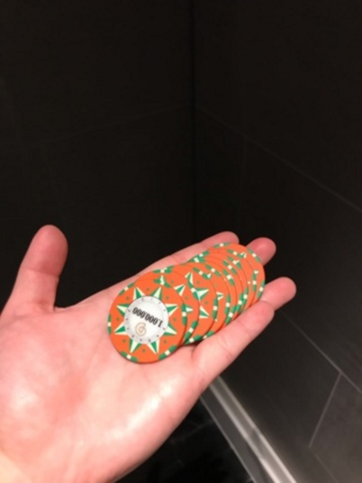
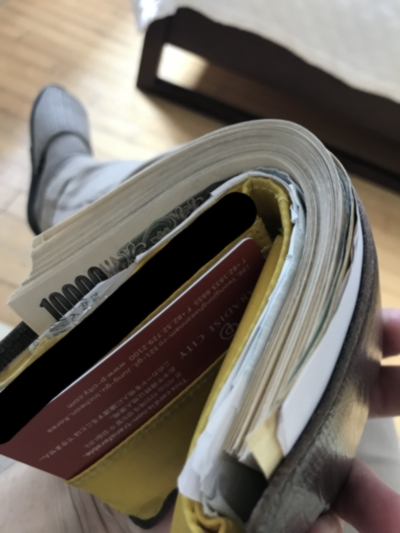
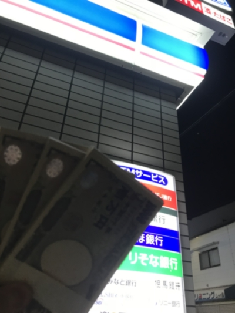
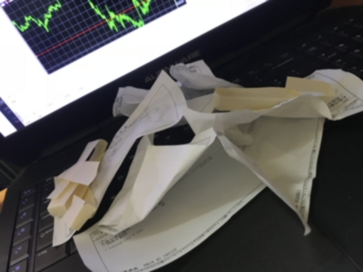

前職やめて長らく無職だったけど、最近就職してちょっと落ち着いたから経緯とか結果とか色々まとめてみようと思います。  
就活生や、転職を考えている新卒2年目の人たちのお役に立てば幸いです。  

転職活動の規模はこんな感じです。  
* 利用した転職支援サービス -> 10以上
* 書類エントリーした会社 -> 100社以上
* 面接を受けた会社 -> 20社以上
* 内定 -> 10以上

一応私のスペックも書いておきます。
* 新卒一年目(当時)エンジニア
* 四年制大学の情報系学科を学部で卒業 (偏差値はギリギリ50行くか行かないかぐらいｗ)
* スキル -> このブログの[aboutページ](../../about/)とか[LAPRAS](https://lapras.com/public/ASZLKRT)を参考にしてください。
* 属性 -> 意識高い系イキリプログラマ  
* 思想 -> ちょっと左寄りのガチ資本主義

本記事は3つに分かれてます。
* [転職してみた -退職編-](../2019-09-30--job-fired/)
* [転職してみた -ニート生活編-](../2019-09-30--job-neet/)   <- イマココ
* [転職してみた -職探し編-](../2019-09-30--job-finding/)

ここでは、無職中の生活や会社を辞めた後の話を書きます。

# 退職直後にやったこと
  
とにもかくにも失業保険を受けるためにハローワークに行きました。自分は会社都合で退職したので、説明会に出席した後一週間ぐらいで支給が開始しました。自己都合退職の場合は待機期間が結構長くなってしまいます・・・  
収入があると働いているとみなされて手当が受け取れない可能性があったので、投資していたお金も一旦全て引き上げました。  
健康保険は継続か国民健康保険にするか選べたのですが、どちらも選択せず無保険状態でした。賢明な皆さんはちゃんとどちらかに加入しておくことをおすすめします。  
一通りの手続きや転職用の書類を揃えたあと、一月ぐらいリフレッシュ休暇を楽しんでました。ずっとApexLegendsやってました。パスファインダー、R-99、Triple Takeが好きです。

## アドバイス
* 会社を辞めたら、ハロワですぐに失業保険の手続きをしましょう。
* 収入があると、失業手当が支給されない可能性があるので気をつけましょう。窓口で相談してみるのもアリです。
* 健康保険を継続するか国民健康保険に加入することをを勧めします。マンションを借りたりする予定がある人は健康保険を継続したほうがいいかもしれません。一説によると信用力が違うらしいです。
* R-99 + 1倍HCOG が一番使いやすい。

# ニートの生活
  
結局、3月末にやめてから次に就職したのは9月になってからなので4月〜8月の5ヶ月間ニートだったことになります。  
4月は先程書きましたが、手続き、書類作成、ApexLegendsをしていましたが、5月から本格的に転職活動を始めます。この頃はすでに前職を退職していたので転職活動ではなく就職活動のほうが正しいですね。具体的な活動内容や詳しい話は「転職してみた -職探し編-」に書きますが、10以上転職支援サービスを使い、100社以上の会社にエントリーしました。このように転職の鬼と化した私ですが、それでも結構時間があったので技術系の勉強をしていました。わざわざこのブログを手作りしたのもフロントの勉強をするためでした。新しい言語やフレームワークの習得、積読してた技術書の消化、Qiita記事の作成など面接で話せそうなネタを増やす活動をしていました。  
もちろん他にも投資の勉強、ApexLegends、友達と遊んだり、カジノに行ったり、就活と関係無いことも結構色々していたんですけどね。  
キャッシュはたんまりあったのでニートの割に金に困りませんでしたが、実家に月5万で住ませてもらってました。お金があっても削れるところは削ります。  
会社辞めてニートになると暇過ぎて辛くなってくる、とよく聞きますが全く暇ではありませんでした。むしろ超楽しかったです。あと1年ぐらいは続けたかった。  

## アドバイス
* ずっとゴロゴロしてるのは時間がもったいないです。
* 未来に向けて自己投資しましょう。勉強しましょう。
* 一般的に、3ヶ月フラフラしてた人は内定を取りにくくなってしまいます。無職になったらさっさと転職活動を始めましょう。
* 無収入でギャンブルやFXをやるのはやめておいたほうがいいです。人のことを言える立場ではありませんが・・・

# ニートの収支
  
## 収入の部
3ヶ月間は失業保険が毎月16万ぐらい貰えました。全部で48万円ですね。働かなくてもこんなにもらえる日本やばいですね。生まれて初めて愛国心という感情を理解することができました。  
カジノでは40万円稼ぎました。調子に乗って10万ほど友人親戚にバラ撒いちゃいましたが。  
失業保険が出ていた4月〜6月は投資をしていませんでしたが、7月末から解禁しました。この頃からFXにハマり、8月にはかなりのキャッシュを投入してフルコミットしていました。ちなみに収入は100万ちょいです。FXの様子はTwitterやこのブログに色々書いています。見ていただければ、決して楽して100万稼いだ訳ではないと理解していただけると思います。  
全部合わせると188万円で、年収換算すると450万円です。悪くないですね。  

## 支出の部
転職活動にめちゃくちゃお金がかかりました。関西に住んでいましたが、関東での就職を考えていたので新幹線に何度も乗ることになります。ある程度まとめて面接に行っていたので往復回数は少ないですが、ホテル代もかなりかかってます。全部で5往復、20泊ぐらいです。関東 - 関西は往復で3万ほどかかります。ホテルは都内の安いところに泊まっていたので平均すると一泊7000円ぐらいです。合計でだいたい30万円ですね。  
他には家賃があります。実家だったので月5万で生活できていました。5ヶ月なので25万円です。  
合計すると55万円。よくよく考えてみると5ヶ月間の出費としてはそんなに多くはないですね。  

## アドバイス
* 実家に住めるなら、実家に住もう。節約しよう。
* 失業保険は意外ともらえるから生活はそんなに困りません。
* ニートするつもりなら、ある程度お金を貯めてから仕事をやめることをおすすめします。
* 転職活動も場合によっては結構お金がかかります。やはり、ある程度お金を貯めてから仕事をやめることをおすすめします。
* 何度も言いますが、無収入でFXやギャンブルをするのはお勧めしません。

# 小金持ちイキリニートの日記
## やることがなさすぎて札束持って写真を撮るワイ
インチキ金運アイテムの広告にありそうな写真が撮れて大変満足である。  
  
## 韓国のカジノへ向かう飛行機で記念撮影  
無職のくせにギャンブルとは、いい身分である。  
ちなみに、100万円以上国外に持ち出す場合は税関で申告しなければいけない。  
申告しないと、入国の際に持っていった現金に対して税金がかかることがある。  
申告して特に損はないからみんなちゃんと申告するんだぞ。  
  
## カジノで勝った記念撮影
今まで生きてきて、自分の運の良さを感じることが多々あった。  
生まれるとき運にパラメータを全振りしてしまったのだろう。  
お陰で顔面と知能のパラメータがずいぶんと低い。  
でも今の所それはそれで悪くないと思っている。  
いや、やっぱり顔面全振りがよかった。  
  
コインの価値は一枚だいたい10万円ぐらい。  
  
換金後の財布  
  
## FX: ドルを買うために深夜コンビニへ
とある金曜日、中国が米国の輸入品に対して報復関税を発表したためにドルが暴落。  
「こりゃ安いｗドル爆買い安定やｗ」とか言いながら嬉々として深夜のコンビニへ300万円をもって向かう無職。  
  
この後、ドルを全力買いするもトランプが余計なことをしたために月曜日更に暴落。  
最大含み損は-60万円を達成。早朝から青い顔をしながらゲロを吐く無職がただ一人。地獄である。  
幸いなことに、この日の午後にはこの件に関して両国間で妥協案を模索する旨が報道され相場は回復。  
つくづく、悪運の強さを感じる。  
ちなみに、銀行ATMは50万円ずつしか入金できなから100万円単位のお金を入金しようとすると結構大変。  
  

# 他記事へのリンク
* [転職してみた -退職編-](../2019-09-30--job-fired/)
* [転職してみた -ニート生活編-](../2019-09-30--job-neet/)   <- イマココ
* [転職してみた -職探し編-](../2019-09-30--job-finding/)