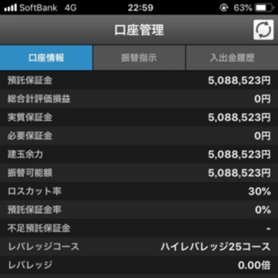

僕が億るまでのロードマップ。  

## 最初の100万円 : 23歳
奨学金を枠いっぱい借りて余った金が100万円。  
新卒一年目の会社員時代はこの100万円で生活することで、かなりの貯金を作ることができた。  
奨学金に感謝。  

## 最初の500万円 : 24歳
新卒一年目でちょくちょく投資的なものをやっていたが、結果は全く出ず飽きてしまう。  
そんな飽き性の僕はあろうことか会社にまで飽きて、新卒で入った会社を一年で辞めてしまう。
この頃の僕の所持金400万円。  
↓会社やめてた後、実家でパシャリ  
  
この直後、カジノやらなんやらの収入で割とすぐに500万円を達成する。  
しばらく失業保険で生活してたけど、それも切れたのでFXを始める。  
はじめは50万ほどでやってたけど、「あれ、これいけんじゃね？」ということで250万追加投入。  
先日、FXの口座残高が500万円を達成。  
  
全財産合わせて700万円ぐらい。  
え？奨学金の返済？奨学金は金利が低いので実質借金0。  
このまま1000万円まで一直線だぜ！  
（あぁ・・・税金が怖い・・・）  

## 最初の1000万円
